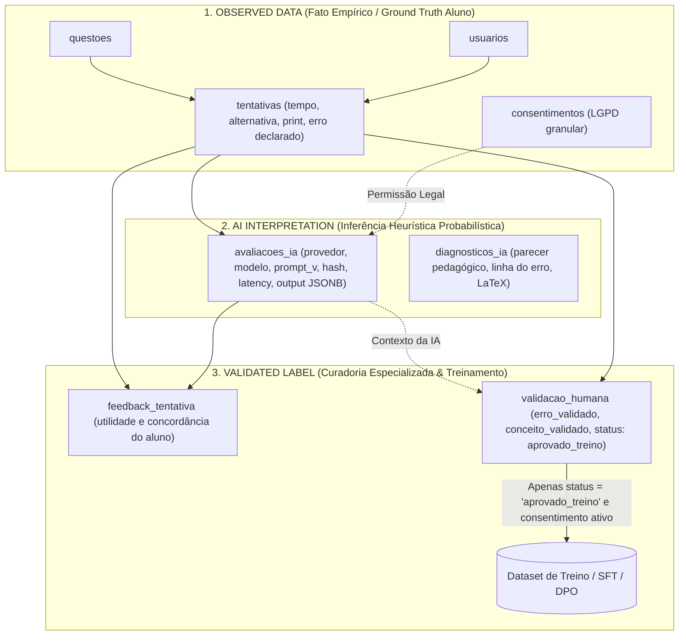

# Arquitetura de Dados com Proveniência Total — Plataforma LEMMAS

A plataforma **LEMMAS** (impulsionada pelo núcleo cognitivo **MathAI Engine**) adota uma filosofia rigorosa de governança de dados e aprendizado contínuo baseada na tríade epistemológica:

$$\mathbf{OBSERVED\ DATA} \neq \mathbf{AI\ INTERPRETATION} \neq \mathbf{VALIDATED\ LABEL}$$

Esta separação impede a contaminação de datasets de treinamento, previne o colapso estocástico de modelos por retroalimentação (*model collapse*) e garante total conformidade com a LGPD.

---

## 🏛️ As Três Camadas Epistemológicas

---

### 1. Camada 1: Observed Data (Fato Empírico)
* **Tabelas:** `usuarios`, `questoes`, `conceitos`, `tentativas`, `revisao_espacada`, `consentimentos`.
* **Definição:** Representa o registro objetivo e inalterável do evento do mundo real.
* **Características:**
  - O que o aluno digitou, o tempo cronometrado em segundos, o gabarito oficial e a fotografia/print do rascunho de resolução.
  - **Imutabilidade Pedagógica:** Uma IA nunca altera o que o aluno fez nem o resultado objetivo da tentativa.
  - **Governança LGPD:** A tabela `consentimentos` isola expressamente as permissões de `coleta_dados`, `processamento_ia`, `uso_pesquisa` e `treinamento_modelos`, permitindo revogação a qualquer momento (`revogado_em`).

---

### 2. Camada 2: AI Interpretation (Inferência Probabilística)
* **Tabelas:** `avaliacoes_ia` (e legado `diagnosticos_ia`).
* **Definição:** É uma hipótese estocástica gerada por modelos de inteligência artificial (Gemini Flash Lite, NVIDIA Nemotron 550B, DeepSeek R1).
* **Características:**
  - **Rastreabilidade Estrita (Audit Trail):** Toda inferência armazena o provedor (`provedor_modelo`), o nome exato do modelo (`nome_modelo`), versão da API (`versao_modelo`), versão controlada do prompt pedagógico (`versao_prompt`), hash de entrada (`input_hash`), latência (`latencia_ms`) e nível do fallback aplicado (`fallback_level`).
  - **Separação de Output:** O texto cru original é retido em `output_raw`, enquanto a estrutura parsed é preservada em `output_estruturado` (`JSONB` indexado via GIN).
  - **Ciclo de Vida Independente:** Se um novo modelo for lançado ou um prompt pedagógico for atualizado, novos registros de interpretação podem ser criados sem apagar nem sobrescrever a tentativa empírica original do estudante.

---

### 3. Camada 3: Validated Label (Curadoria Humana Padrão-Ouro)
* **Tabelas:** `feedback_tentativa`, `validacao_humana`.
* **Definição:** O veredito qualificado produzido por humanos (tanto pelo próprio estudante quanto por professores e avaliadores de Matemática).
* **Características:**
  - **Feedback do Aluno (`feedback_tentativa`):** O aluno sinaliza se o feedback foi útil (`util = true/false`), se concorda com o diagnóstico apontado e fornece observações subjetivas.
  - **Curadoria do Especialista (`validacao_humana`):** Um professor valida a tentativa e o diagnóstico, cravando `erro_validado`, `conceito_validado` e o status formal:
    * `aprovado_treino`: Dado de alta fidelidade elegível para o dataset de Fine-Tuning / DPO.
    * `ambiguo`: Resolução inconclusiva ou caligrafia duvidosa.
    * `rejeitado`: Tentativa inválida, cópia espúria ou diagnóstico incorreto da IA.
  - **Proteção do Dataset de IA:** **Nenhum** dado é injetado nos pipelines de treinamento da MathAI Engine a menos que possua `status_validacao = 'aprovado_treino'` e o aluno possua `treinamento_modelos = true` e `revogado_em IS NULL` em `consentimentos`.

---

## 📁 Estrutura dos Arquivos de Schema

| Arquivo | Descrição |
|---|---|
| [`01_core_tables.sql`](./01_core_tables.sql) | DDL das tabelas fundamentais: `usuarios`, `questoes`, `conceitos`, `tentativas` e `revisao_espacada` (SM-2). Inclui índices cobrindo chaves estrangeiras e políticas de RLS. |
| [`02_provenance_and_consent.sql`](./02_provenance_and_consent.sql) | DDL das tabelas de proveniência total: `consentimentos`, `avaliacoes_ia`, `feedback_tentativa` e `validacao_humana`. Inclui índices GIN, verificações de integridade (`CHECK`) e RLS habilitado. |

---

## 🛡️ Segurança e Row Level Security (RLS)

Todas as tabelas do ecossistema LEMMAS no Supabase possuem:
1. `ROW LEVEL SECURITY` explicitamente habilitado.
2. Políticas ativas garantindo integridade de operações da aplicação web e da engine de IA.
3. Chaves estrangeiras cobertas por índices B-Tree para evitar gargalos de performance e scans sequenciais em joins e cascatações.
