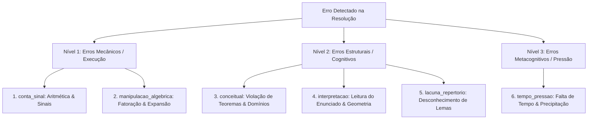

# Métricas de Avaliação, Concordância e Taxonomia de Erros (AI Evaluation)

> **Documento:** Metodologia de Avaliação Contínua de Modelos, Concordância Inter-Anotadores e Taxonomia de Erros  
> **Status:** Ativo / Produção  
> **Última Atualização:** 2026-10-08  
> **Área:** Ciência de Dados & Avaliação Pedagógica (LEMMAS / MathAI Engine)  

---

## 1. Visão Geral da Avaliação de Modelos Matemáticos

Avaliar um modelo de inteligência artificial em Matemática difere radicalmente de tarefas comuns de Processamento de Linguagem Natural (NLP). Métricas tradicionais de texto como BLEU e ROUGE são completamente inadequadas para expressões matemáticas: uma única alteração de sinal (trocar $+$ por $-$) ou a inversão de um expoente altera completamente a validade lógica de um cálculo, mesmo que a similaridade textual seja de 98%.

A **MathAI Engine** estabelece um framework de avaliação tripartite:
1. **Rigor Matemático & Equivalência Simbólica** (CAS / SymPy).
2. **Fidelidade de Transcrição Multimodal** (CER/WER em LaTeX).
3. **Qualidade Pedagógica & Intervenção Socrática** (Índice Socrático e Taxonomia de Erros).

---

## 2. Métricas Quantitativas de Avaliação

### 2.1. Equivalência Simbólica via Álgebra Computacional (CAS)
Para verificar se a resposta ou passo intermediário gerado pela IA é matematicamente idêntico ao gabarito, não comparamos strings brutas. Utilizamos o sistema de álgebra computacional **SymPy**:

$$\text{Equivalente}(A, B) \iff \text{simplify}(A - B) = 0$$

Essa abordagem reconhece que:
$$\frac{1}{\sqrt{2}} \equiv \frac{\sqrt{2}}{2} \quad \text{e} \quad \sin^2(x) + \cos^2(x) \equiv 1$$

### 2.2. Character Error Rate (CER) e Word Error Rate (WER) em LaTeX
Avalia a fidelidade do motor OCR (Gemini Flash Lite) na digitalização de rascunhos manuscritos:

$$\text{CER} = \frac{S + D + I}{N}$$

Onde:
- $S$: Número de substituições de caracteres (ex: transcrever $\beta$ como $B$).
- $D$: Número de deleções (caractere omitido).
- $I$: Número de inserções indevidas.
- $N$: Total de caracteres da transcrição humana canônica (Ground Truth).

**Meta de Produção:** $\text{CER} < 3.5\%$ em fórmulas matemáticas manuscritas.

### 2.3. Índice Socrático ($I_s$)
Mede a capacidade do modelo de conduzir o aluno à descoberta autônoma sem entregar a resposta de bandeja:

$$I_s = \frac{\text{Perguntas Reflexivas \& Lemas Sugeridos}}{\text{Passos de Resolução Direta Fornecidos}}$$

- $I_s > 2.0$: **Excelente postura socrática** (o modelo incentiva a reflexão e estimula a metacognição).
- $I_s < 0.5$: **Postura expositiva inadequada** (o modelo entrega a resposta, gerando dependência no estudante).

---

## 3. Taxonomia Pedagógica de Erros Matemáticos

A plataforma adota uma taxonomia hierárquica e determinística inspirada nas melhores práticas de educação matemática e análise de erros de Hadamard e Polya:

### 3.1. Descrição Detalhada das Categorias

| Categoria | Código do Sistema | Descrição Matemática e Sintomas | Exemplo Prático |
|---|---|---|---|
| **Aritmética & Sinais** | `conta_sinal` | O estudante aplicou os conceitos corretos, mas errou uma soma, subtração, tabuada ou errou a propagação de sinal negativo na distributiva. | Escrever $-(x - 3) = -x - 3$ em vez de $-x + 3$. |
| **Manipulação Algébrica** | `manipulacao_algebrica` | Falha na simplificação de frações, produtos notáveis, potenciação ou inversão incorreta de membros da igualdade. | Afirmar que $\sqrt{a^2 + b^2} = a + b$ ou cancelar termos em somas: $\frac{a+b}{a} = b$. |
| **Erro Conceitual** | `conceitual` | Violação de hipóteses de teoremas, divisão inadvertida por zero, desrespeito ao domínio de logaritmos/raízes pares, ou confusão entre implicação ($\Rightarrow$) e bi-implicação ($\Leftrightarrow$). | Aplicar Regra de L'Hôpital em limites onde a forma não é indeterminada ($\frac{0}{0}$ ou $\frac{\infty}{\infty}$). |
| **Interpretação** | `interpretacao` | O aluno calculou perfeitamente, mas respondeu o que a questão não pediu (ex: calculou o raio quando a banca pedia o diâmetro, ou confundiu a unidade de medida). | Ignorar a palavra "não", "exceto" ou confundir a hipotenusa com um cateto no enunciado. |
| **Lacuna de Repertório** | `lacuna_repertorio` | A questão exigia uma ferramenta específica que o estudante não conhece ou não ativou o gatilho mental (ex: Teorema de Menelaus, Desigualdade das Médias MA-MG, Relações de Girard). | Tentar resolver um sistema simétrico de grau 4 por substituição braçal em vez de usar polinômios simétricos elementares. |
| **Pressão de Tempo** | `tempo_pressao` | Aceleração desordenada no término da prova, levando a rascunhos truncados e chutes sem embasamento. | Deixar a questão inacabada nos últimos 2 passos devido a cronometragem estourada. |

---

## 4. Taxa de Concordância Inter-Anotadores (IAA)

Para validar a confiabilidade dos diagnósticos pedagógicos gerados pelos modelos frente ao parecer de professores humanos de Matemática (especialmente do corpo docente e discente da Universidade Federal Fluminense - UFF), o sistema calcula o coeficiente **Kappa de Cohen ($\kappa$)**:

$$\kappa = \frac{P_o - P_e}{1 - P_e}$$

Onde:
- $P_o$: Proporção de concordância observada entre o modelo de IA e o professor avaliador.
- $P_e$: Proporção de concordância esperada pelo acaso.

### 4.1. Escala de Interpretação e Metas de Produção

| Intervalo de $\kappa$ | Nível de Concordância | Status na Plataforma LEMMAS |
|---|---|---|
| $< 0.40$ | Fraco | **Bloqueio de Modelo:** Rejeitado para uso em produção. |
| $0.41 - 0.60$ | Moderado | Fila obrigatória de revisão humana (Active Learning). |
| $0.61 - 0.80$ | Substancial | **Meta Mínima Homologada** para diagnósticos pedagógicos. |
| $> 0.81$ | Quase Perfeito | **Padrão Ouro (Gold Standard):** Promovido a validador autônomo. |

### 4.2. Protocolo de Resolução de Discrepâncias
Quando ocorre discordância entre a classificação do modelo e o reporte do aluno:
1. **Triagem Automática:** A questão e a resolução são encaminhadas para adjudicação cega por dois modelos concorrentes (ex: Gemini Flash Lite e NVIDIA Nemotron 550B).
2. **Desempate Humano:** Se a divergência persistir, o caso entra no topo da fila de curadoria do professor responsável pela matéria, cuja decisão torna-se a verdade de solo (*ground truth*) gravada no dataset permanente.
