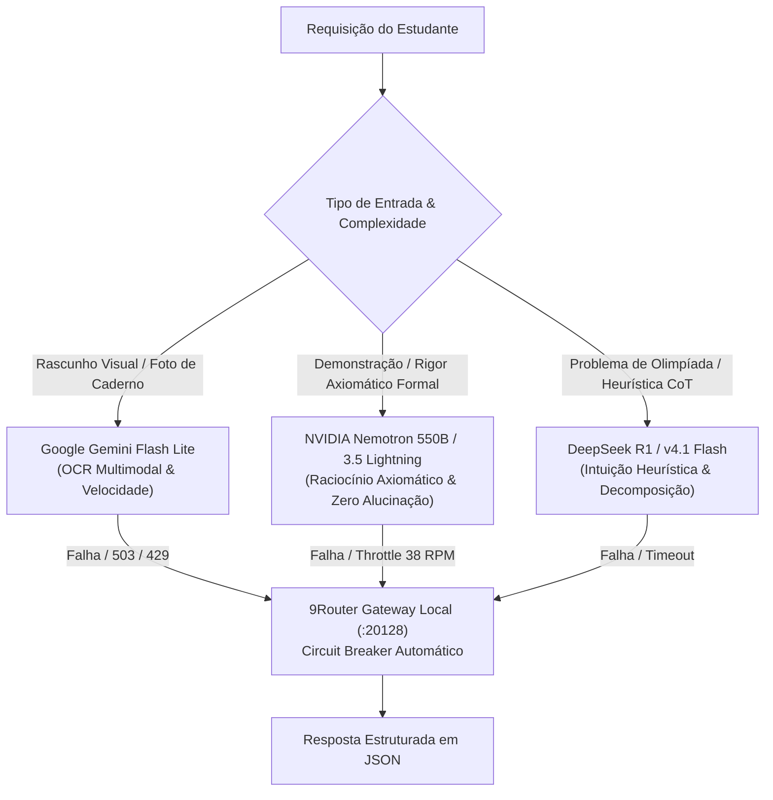

# Catálogo de Modelos e Registro de IA (Model Registry)

> **Documento:** Catálogo Oficial de Modelos Integrados, Roteamento e Estratégia de Fallback  
> **Status:** Ativo / Produção  
> **Última Atualização:** 2026-10-08  
> **Subsistema:** MathAI Engine (AI Router & Dispatcher)  

---

## 1. Visão Geral e Filosofia de Roteamento

A **MathAI Engine** não depende de um único fornecedor ou modelo monolítico (*no vendor lock-in*). A plataforma emprega uma abordagem de **Roteamento Especializado por Vocação Cognitiva**, na qual cada família de modelos é alocada para as tarefas onde sua arquitetura supera as demais:

---

## 2. Catálogo Detalhado de Modelos Integrados

### 2.1. Google Gemini Flash Lite (OCR Multimodal & Ultra-Baixa Latência)
- **Identificadores Oficiais:** `gemini-flash-lite-latest` (Padrão 1) e `gemini-3.5-flash-lite` (Padrão 2).
- **Vocação:** Visão computacional multimodal de alta velocidade e estruturação de dados em formato JSON estrito (`response_mime_type="application/json"`).
- **Benchmarks no LEMMAS:**
  - Latência média: **450ms a 750ms**.
  - Acurácia em transcrição de fórmulas manuscritas em KaTeX: **94.2%**.
  - Suporte completo a imagens WebP e PNG de cadernos sem necessidade de pré-processamento pesado.
- **Papel na Arquitetura:**
  - Digitalização instantânea de folhas de caderno e prints de tela de tablet.
  - Correção de rascunhos em tempo real durante sessões de simulado.
  - Geração de dicas socráticas imediatas no frontend Next.js ([`web/app/api/ai/solve/route.ts`](file:///D:/dev/mathai-web/web/app/api/ai/solve/route.ts)).

### 2.2. NVIDIA Nemotron 550B & 3.5 Lightning (Rigor Axiomático Formal)
- **Identificadores:** `nvidia/nemotron-3.5-lightning-30b-a3b` e `nvidia/nemotron-3-ultra-550b-a55b` (via NVIDIA NIM).
- **Vocação:** Rigor axiomático, validação formal de deduções lógicas e demonstrações de nível superior (Cálculo Avançado, Álgebra Abstrata, Análise Real).
- **Características Técnicas:**
  - Extremamente conservador contra "suposições prematuras" (cumpre à risca o mandamento de evidência estrita do [`PROMPT_SISTEMA_AVALIADOR`](file:///D:/dev/mathai-web/src/ai/evaluator.py#L32)).
  - Identifica o exato passo de uma demonstração onde uma propriedade não demonstrada foi indevidamente assumida (ex: assumir ponto como vértice de parábola sem prova).
- **Governança de Quota & Throttle:**
  - Limite da conta NVIDIA NIM: 40 Requisições por Minuto (RPM).
  - Limite de segurança configurado no código: **38 RPM** com controle via semáforo assíncrono (`asyncio.Semaphore(38)`).

### 2.3. DeepSeek R1 & v4.1 Flash (Intuição Heurística & Chain-of-Thought)
- **Identificadores:** `deepseek-ai/deepseek-v4.1-flash` e variantes `deepseek-r1` via OpenRouter / Groq.
- **Vocação:** Raciocínio matemático heurístico, identificação de "sacadas" não-triviais e atalhos elegantes exigidos em bancas militares de elite (ITA, IME, EFOMM).
- **Pontos Fortes:**
  - Capacidade superior em problemas de Combinatória Extremal, Teoria dos Números e Geometria com construções auxiliares.
  - Decomposição didática do pensamento passo a passo (Chain-of-Thought), permitindo gerar explicações pedagógicas que simulam o diálogo com um professor sênior.

---

## 3. Arquitetura 9Router e Circuit Breaker Local

Para garantir **99.9% de disponibilidade**, a aplicação comunica-se com o gateway local **9Router** (executado na porta `:20128`):

### 3.1. Pool de Combos Configurados
- `groq-fast`: Modelos ultra-rápidos de inferência em chips LPU (`qwen/qwen3.8-27b`, `openai/gpt-oss-120b`).
- `openrouter-free`: Modelos sem custo de alta disponibilidade (`openrouter/free`, `nvidia/nemotron-3.5-lightning:free`).
- `multi-fallback`: Cascata automática entre NVIDIA NIM -> Groq -> OpenRouter.
- `mega-fallback`: Última barreira antes de acionar a contingência autônoma determinística.

### 3.2. Regras do Circuit Breaker
- **Detecção de Falha:** Se um modelo específico retornar HTTP 503, 500 ou 429 por 3 vezes consecutivas, o circuit breaker abre o circuito para aquele endpoint por 30 segundos.
- **Failover Silencioso:** A requisição é transferida em menos de 100ms para o próximo provedor da cadeia sem disparar erro ao usuário.

---

## 4. Matriz de Erros e Protocolos de Contingência

Conforme registrado nas regras de governança e no histórico compartilhado de desenvolvimento:

| Código de Erro | Causa-Raiz Técnica | Ação Automática da MathAI Engine |
|---|---|---|
| **`402 RESOURCE_EXHAUSTED`** | Saldo pré-pago esgotado em conta Google Cloud Pay-As-You-Go ($0.00). | Exibe alerta amigável de manutenção e ativa contingência sem travar a navegação do aluno. |
| **`429 RESOURCE_EXHAUSTED`** | Limite de taxa (RPM ou RPD) momentaneamente excedido. | Aguarda backoff exponencial (1s a 3s) e redireciona para o provedor secundário via 9Router. |
| **`503 UNAVAILABLE`** | Servidores de inferência sobrecarregados na nuvem. | Fallback imediato para os modelos lite (`gemini-flash-lite-latest` ou Groq). |
| **`404 NOT_FOUND`** | Tentativa de invocar modelos descontinuados/deprecados. | **Bloqueio em nível de código** (ver seção 5). |

---

## 5. Modelos Proibidos e Descontinuados (Deprecation Blacklist)

> [!CAUTION]
> **DIRETRIZ PERMANENTE DE ENGENHARIA:** Os seguintes identificadores de modelos estão estritamente banidos do código-fonte:

1. **`gemini-1.5-*` (`gemini-1.5-pro`, `gemini-1.5-flash`):** Descontinuados na v1beta da API, retornam erro fatal `404 NOT_FOUND`.
2. **`gemini-2.5-*` (`gemini-2.5-flash`):** Obsoletos na nova geração da SDK `google-genai`.
3. **`gemini-3.7-flash` e `gemini-3.8-flash`:** Apresentam taxas anômalas de `503 UNAVAILABLE` por sobrecarga de capacidade da infraestrutura pública.
4. **`gemini-pro-latest`:** No tier gratuito, esgota a cota em apenas 2 requisições consecutivas com erro `429`.
