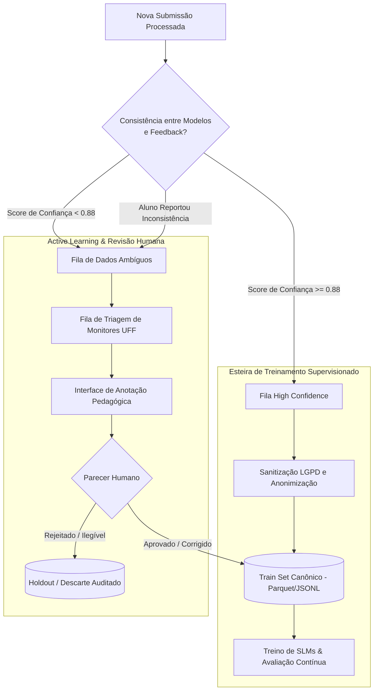

# Pipeline de Treinamento Futuro & Flywheel de Machine Learning

> **Documento:** Especificação Técnica do Pipeline de Treinamento, Active Learning e Flywheel ML  
> **Status:** Ativo / Planejamento Técnico e Arquitetural  
> **Última Atualização:** 2026-10-08  
> **Área:** Inteligência Artificial & Ciência de Dados (LEMMAS / MathAI Engine)  

---

## 1. Visão Geral: O Flywheel Matemático

O objetivo de longo prazo da **MathAI Engine** dentro da plataforma **LEMMAS** é transformar cada interação cotidiana de resolução de exercícios em um ativo de dados proprietário e curado. 

Esse processo cria um **Flywheel de Aprendizado de Máquina (Data Flywheel)**:
1. Mais estudantes usam a plataforma para treinar para concursos e graduação.
2. Mais rascunhos reais, erros conceituais e justificativas autênticas são coletados com metadados detalhados de tempo e metacognição.
3. O pipeline de Active Learning seleciona e audita os dados mais ricos pedagogicamente.
4. Modelos menores e especializados (Small Language Models - SLMs e Vision LoRAs) são ajustados por fine-tuning local.
5. A latência diminui, a acurácia no reconhecimento de caligrafias complexas aumenta e a personalização socrática atinge nível de excelência pedagógica, atraindo ainda mais estudantes.

```
       ┌────────────────────────────────────────────────────────┐
       │             1. Maior Volume de Alunos                  │
       │           (Graduação UFF, IME/ITA, Militares)          │
       └───────────────────────────┬────────────────────────────┘
                                   │
                                   ▼
       ┌────────────────────────────────────────────────────────┐
       │             2. Coleta de Evidência Autêntica           │
       │       (Rascunhos reais, tempos, erros matemáticos)     │
       └───────────────────────────┬────────────────────────────┘
                                   │
                                   ▼
       ┌────────────────────────────────────────────────────────┐
       │             3. Active Learning & Particionamento       │
       │        (High-Confidence vs Revisão Humana de Erros)    │
       └───────────────────────────┬────────────────────────────┘
                                   │
                                   ▼
       ┌────────────────────────────────────────────────────────┐
       │             4. Fine-Tuning de SLMs Especializados      │
       │        (Qwen-2.5-Math, Llama-3-8B LoRA, DKT Cognitivo) │
       └───────────────────────────┬────────────────────────────┘
                                   │
                                   ▼
       ┌────────────────────────────────────────────────────────┐
       │             5. Menor Latência, Custo Zero e            │
       │               Maior Acurácia Diagnóstica               │
       └───────────────────────────┬────────────────────────────┘
                                   │
                                   └───────────────► (Retroalimenta o Passo 1)
```

---

## 2. Arquitetura de Particionamento: High Confidence vs. Ambiguous Data

Para evitar o fenômeno de **Data Poisoning** (onde modelos são treinados com alucinações de modelos anteriores), o pipeline implementa uma separação epistemológica e probabilística rígida:



### 2.1. Critérios para o Conjunto de Alta Confiança (High Confidence Set)
Um registro é promovido automaticamente ao **Train Set** apenas quando satisfaz cumulativamente:
1. **Consistência Lógica:** O status de acerto/erro computado matematicamente coincide com a inferência do modelo (`acertou == (status_resolucao == 'correto')`).
2. **Consenso Multi-Modelo:** Se avaliado concorrentemente (ex: Gemini Flash Lite e NVIDIA Nemotron), ambos concordam na classificação da categoria de erro (`tipo_erro`).
3. **Ausência de Contestação:** O estudante não abriu reporte de inconsistência na tabela `questoes_reportadas`.
4. **Metacognição Coerente:** Em caso de erro com confiança 5 ("certeza"), a justificativa textual foi analisada e classificada com alta probabilidade de erro conceitual (evidenciando um *misconception* clássico e valioso para aprendizado).

### 2.2. Critérios para a Fila de Ambiguidade (Holdout / Active Learning)
Registros são direcionados à fila de inspeção humana quando:
1. **Discordância de Gabarito:** O aluno chegou à resposta correta final, mas a IA acusou erro no procedimento intermediário (possível método alternativo não mapeado ou falso positivo da IA).
2. **Baixa Confiança de OCR:** Expressões em LaTeX geradas possuem pontuações de perplexidade anômalas ou marcadores de texto truncado.
3. **Contestação Explícita:** O estudante clicou no botão "Reportar Inconsistência" ou informou que sua resolução estava correta.
4. **Resoluções Inéditas:** A estratégia identificada difere de todas as estratégias previamente cadastradas no acervo (`estrategias_esperadas`).

---

## 3. Estratégias de Active Learning

Em vez de rotular dados aleatoriamente, o sistema emprega duas estratégias fundamentadas em Ciência de Dados:

### 3.1. Amostragem por Incerteza (Uncertainty Sampling)
Prioriza para revisão humana os casos onde a probabilidade atribuída pelo classificador do modelo está mais próxima da fronteira de decisão:

$$U(x) = 1 - \max_{y \in \mathcal{Y}} P(y \mid x)$$

Onde $\mathcal{Y}$ representa o conjunto de taxonomias de erro (aritmético, algébrico, conceitual, interpretação, repertório). Amostras com $U(x) > 0.40$ são enviadas prioritariamente para a bancada de anotação de monitores.

### 3.2. Amostragem por Diversidade Temática e Cobertura (Diversity Sampling)
Garante que o dataset de treino não sofra de viés de representatividade (por exemplo, excesso de questões de progressões aritméticas simples e carência de demonstrações de Cálculo Avançado ou Geometria com Teorema de Ceva/Menelaus).
- Utiliza **embeddings matemáticos** gerados a partir do enunciado e da transcrição LaTeX.
- Agrupa resoluções via clustering (k-means / HDBSCAN) e seleciona os centróides e os *outliers* de cada cluster para auditoria manual.

---

## 4. Modelos-Alvo e Tarefas de Fine-Tuning

O pipeline tem três frentes de modelagem planejadas:

### 4.1. Small Language Models (SLMs) para Diagnóstico e Pedagogia Socrática
- **Modelos Base:** `Qwen/Qwen2.5-Math-7B-Instruct` e `meta-llama/Meta-Llama-3-8B-Instruct`.
- **Objetivo:** Rodar inferência localmente ou em instâncias de baixo custo (GPU com 16GB VRAM ou Quantização Q4_K_M em CPU/vLLM), gerando diagnósticos matemáticos sem dependência de APIs externas pagas.
- **Formato de Treino:** Instrução supervisionada (SFT - Supervised Fine-Tuning) com Direct Preference Optimization (DPO) para punir spoilers diretos de resposta e premiar perguntas reflexivas que estimulem a metacognição.

### 4.2. Vision-Language LoRA para OCR Matemático Ruidoso
- **Modelos Base:** `Qwen2-VL-7B-Instruct` ou `Llama-3.2-11B-Vision-Instruct`.
- **Objetivo:** Especializar o modelo no reconhecimento de caligrafias brasileiras em folhas de caderno pautado, com rasuras, setas explicativas e notações matemáticas informais usadas por estudantes.
- **Métrica de Otimização:** Redução do Character Error Rate (CER) em fórmulas LaTeX complexas (frações empilhadas, raízes e matrizes).

### 4.3. Deep Knowledge Tracing (DKT) e Algoritmo SM-2 Aumentado
- **Arquitetura:** Redes Recorrentes (LSTM / GRU) e Transformers Temporais (SAINT+ / AKT - Context-Aware Attentive Knowledge Tracing).
- **Objetivo:** Prever a probabilidade de um estudante $i$ acertar uma questão $j$ no tempo $t$ com base em seu histórico completo de tentativas, tempo gasto e nível de confiança.
- **Integração com LEMMAS Core:** Os pesos preditos pelo DKT ajustam dinamicamente o *Easiness Factor* (EF) do algoritmo SuperMemo-2, personalizando os intervalos de repetição espaçada muito além de uma fórmula estática.

---

## 5. Protocolo de Avaliação Contínua e Governança de Modelos

Nenhum modelo treinado substitui o modelo em produção sem antes passar por um rigoroso *Shadow Deployment* (Testes A/B silenciosos):
1. **Pass@1 Matemático:** O novo modelo deve acertar a resolução independente de um conjunto de teste fixo de 500 questões desafiadoras de concursos (ITA, IME, EFOMM).
2. **SymPy / CAS Validation:** Soluções numéricas e algébricas são validadas computacionalmente por sistemas de álgebra simbólica (SymPy).
3. **Índice Socrático:** Análise automatizada para garantir que o modelo não entrega o gabarito final prematuramente nas primeiras etapas de ajuda.
