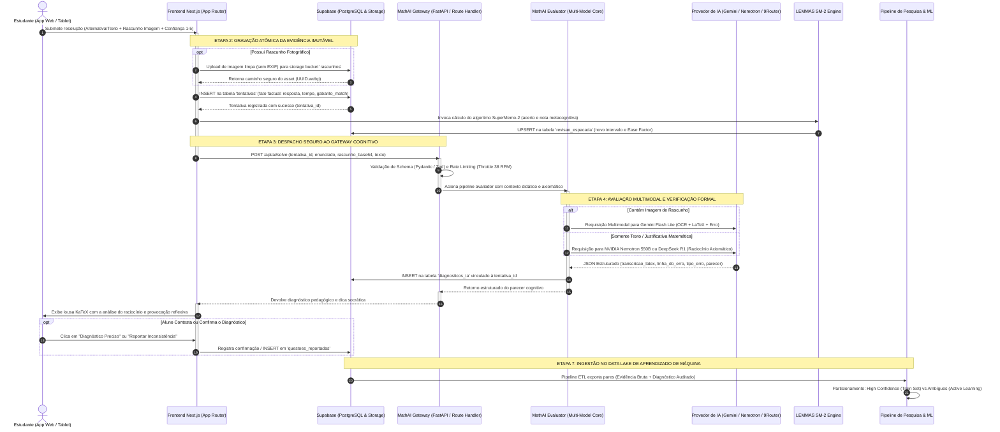

# Fluxo de Dados e Ciclo de Vida da Informação (Data Flow)

> **Documento:** Fluxo de Coleta, Processamento Cognitivo e Ciclo de Vida da Evidência  
> **Status:** Ativo / Produção  
> **Última Atualização:** 2026-10-08  
> **Módulo:** LEMMAS Core & MathAI Engine  

---

## 1. Princípio Epistemológico Fundamental: Fato vs. Inferência

O diferencial arquitetural do **LEMMAS (impulsionado pela MathAI Engine)** reside no seu princípio de integridade de dados:

> **Regra de Ouro:** Dados observados no mundo real são fatos imutáveis. Diagnósticos gerados por modelos de inteligência artificial são interpretações probabilísticas transitórias e nunca devem sobrescrever ou poluir a verdade fática.

Essa distinção é o alicerce que protege a base de conhecimento contra contaminação por alucinações de LLMs e viabiliza a criação de um dataset científico de altíssima fidelidade para treinamento de futuros modelos preditivos de *Knowledge Tracing* e *Automatic Reasoning*.

| Categoria | Definição | Exemplos no LEMMAS | Destino / Persistência |
|---|---|---|---|
| **RAW DATA (Observado)** | Evidência objetiva e factual coletada diretamente da interação do estudante com o ambiente. | Alternativa assinalada (`resposta_enviada`), tempo exato gasto em segundos (`tempo_segundos`), correspondência exata com o gabarito oficial (`acertou`), nota de metacognição (`confianca_aluno`), foto/print do rascunho (`imagem_resolucao_path`), justificativa digitada crua. | Tabela `tentativas`, Supabase Storage (PNG/JPG imutável com checksum SHA-256). |
| **DERIVED DATA (IA)** | Inferência probabilística gerada por visão computacional ou modelo de linguagem. | Transcrição das equações em LaTeX (`transcricao_latex`), identificação da linha exata onde ocorreu o erro (`linha_do_erro`), classificação da falha (`tipo_erro`), sugestão reflexiva socrática (`dica_proximo_passo`). | Tabela `diagnosticos_ia`, `log_dicas_socraticas`. |
| **VALIDATED DATA (Humano/Curadoria)** | Feedback de confirmação, correção de rota dada pelo próprio estudante ou auditoria feita por professores/monitores de matemática. | Validação se o diagnóstico estava correto (`confirmado_pelo_aluno`), reporte de erro no gabarito oficial (`questoes_reportadas`), anotações de curadores. | Tabela `questoes_reportadas`, filas de Active Learning. |

---

## 2. O Fluxo de Dados Ponta a Ponta

O ciclo de vida completo da informação percorre 6 etapas estritamente encadeadas:

```
[1. ALUNO]
    │
    ▼
[2. RAW DATA IMUTÁVEL] ──(Persistência atômica imediata)──► [(tentativas / Storage)]
    │
    ▼
[3. MATHAI GATEWAY] ──(Rate Limit, Circuit Breaker, Sanitização)
    │
    ▼
[4. AI_EVALUATION] ──(OCR Multimodal + Rigor Axiomático)──► [(diagnosticos_ia)]
    │
    ▼
[5. FEEDBACK DO ALUNO] ──(Diagnóstico Socrático + Agendamento SM-2)
    │
    ▼
[6. DADOS PARA PESQUISA/ML] ──(Curadoria, Dataset de Treino, Active Learning)
```

---

## 3. Diagrama Completo em Mermaid

### 3.1. Visão Sequencial da Submissão e Avaliação



---

## 4. Detalhamento Operacional de Cada Etapa

### Etapa 1: Submissão do Aluno
O estudante visualiza a questão na interface com estética de lousa de giz ([`resolver/page.tsx`](file:///D:/dev/mathai-web/web/app/(app)/resolver/page.tsx)). Durante a resolução, a plataforma captura:
- **Tempo cronometrado:** Tempo real gasto em segundos antes da submissão.
- **Rascunho multimodal:** Desenho em canvas touch ou fotografia de folha de papel de caderno enviada pelo celular/tablet.
- **Justificativa textual voluntária:** Argumentação livre do aluno sobre como chegou à resposta.
- **Autoavaliação metacognitiva:** Escala Likert de 1 a 5 (1 = "chutei sem ideia", 5 = "certeza axiomática absoluta").

### Etapa 2: Gravação do Raw Data Imutável
Antes de qualquer comunicação com servidores de IA:
1. Os dados brutos são gravados com garantia ACID no banco relacional (`tentativas`).
2. O acerto/erro lógico é calculado determinísticamente comparando a resposta enviada com o gabarito oficial da banca (ESA, IME, ITA, EFOMM, OBMEP).
3. A foto é sanitizada, redimensionada e armazenada no bucket de storage seguro.
4. O motor de repetição espaçada SM-2 calcula o próximo ciclo de revisão na tabela `revisao_espacada`.

### Etapa 3: MathAI Gateway
O gateway atua como proxy inteligente de borda:
- **Sanitização de caracteres:** Protege contra caracteres de escape corrompidos que possam quebrar parsers JSON.
- **Circuit Breaker:** Se o provedor primário estiver em sobrecarga (HTTP 429 ou 503), o gateway desvia a chamada para o 9Router local ou para o modelo secundário sem que o estudante perceba atraso.
- **Prevenção de Abuso:** Rate limits configurados por usuário para evitar consumo indevido de cotas.

### Etapa 4: AI Evaluation (Visão Multimodal e Verificação Formal)
A IA recebe o enunciado da questão, o gabarito oficial, as estratégias esperadas e a evidência fornecida pelo estudante.
- **Transcrição KaTeX:** Reconhece frações, limites, integrais e matrizes desenhadas à mão, convertendo-as em código LaTeX limpo.
- **Rigor Matemático:** Conforme ditado no [`PROMPT_SISTEMA_AVALIADOR`](file:///D:/dev/mathai-web/src/ai/evaluator.py#L21-L100), o sistema tem proibição estrita de assumir hipóteses que o estudante não declarou.
- **Persistência Derivada:** O resultado da IA é registrado na tabela `diagnosticos_ia` com a indicação explícita do modelo (`modelo_gemini` / `modelo_nvidia`).

### Etapa 5: Feedback ao Estudante
O estudante recebe na tela:
1. Sua pontuação no exercício e a atualização de seu streak de estudos.
2. A transcrição em LaTeX do que a IA entendeu de seu rascunho (permitindo que o aluno perceba se a caligrafia foi mal compreendida).
3. Uma dica socrática provocativa, orientando o próximo passo sem estragar o aprendizado com spoilers desnecessários.

### Etapa 6: Alimentação do Flywheel de Pesquisa e Machine Learning
Os dados coletados alimentam o pipeline contínuo de aprendizado:
- Casos em que o aluno concorda com o parecer ou em que modelos de alta capacidade convergem são rotulados como **High Confidence**.
- Casos controversos ou com relatórios de divergência são enviados para a esteira de curadoria de **Active Learning** para revisão por estudantes de graduação ou professores de matemática.
