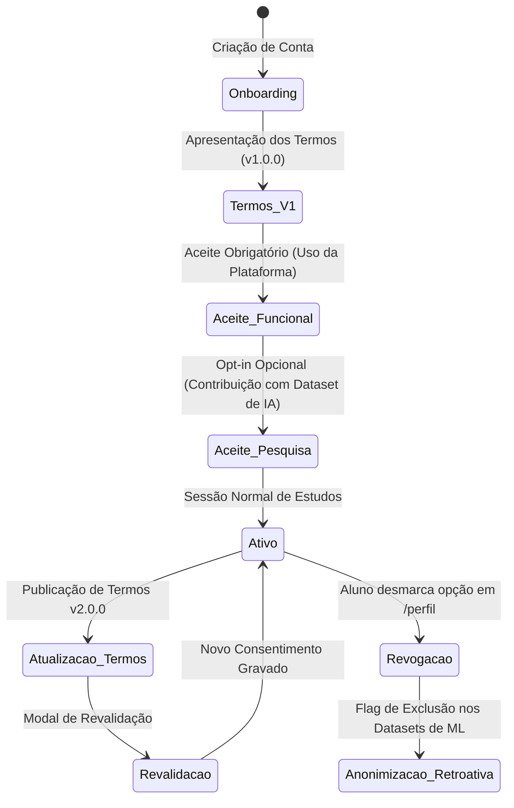

# Governança de Dados, Privacidade e Consentimento (LGPD)

> **Documento:** Política Técnica de Privacidade, Consentimento Versionado e Anonimização de Dados  
> **Status:** Ativo / Produção  
> **Última Atualização:** 2026-10-08  
> **Conformidade Legal:** Lei Geral de Proteção de Dados (Lei nº 13.709/2018 - LGPD) & GDPR  

---

## 1. Princípios e Enquadramento Legal (LGPD)

A plataforma **LEMMAS** e o motor **MathAI Engine** processam dados educacionais sensíveis de estudantes (incluindo imagens de cadernos, tempos de resposta e métricas metacognitivas). O tratamento desses dados é regido pelas seguintes bases legais da LGPD:

1. **Execução de Contrato e Termos de Uso (Art. 7º, inciso V):**
   - Necessário para prestação do serviço: autenticação, cálculo de repetição espaçada SM-2, geração de diagnósticos pedagógicos sob demanda e manutenção do histórico do estudante.
2. **Consentimento Expresso e Destacado (Art. 7º, inciso I):**
   - Requerido para a inclusão de imagens de rascunhos e justificativas de resolução em *datasets* agregados de pesquisa acadêmica e treinamento de modelos de inteligência artificial.
3. **Legítimo Interesse com Salvaguardas Éticas (Art. 7º, inciso IX):**
   - Utilizado para métricas agregadas de desempenho da plataforma, detecção de instabilidades e aprimoramento contínuo dos algoritmos heurísticos, sempre sob anonimização estrita.

---

## 2. Consentimento Versionado

O consentimento do estudante nunca é genérico, implícito ou vitalício sem controle. A plataforma adota um modelo de **Consentimento Granular e Versionado**:



### 2.1. Estrutura de Modelagem do Consentimento
Para rastrear com precisão forense o momento e as condições em que o usuário concedeu permissão:

```sql
CREATE TABLE IF NOT EXISTS consentimentos_usuarios (
    id INTEGER PRIMARY KEY SERIAL,
    usuario_id INTEGER NOT NULL REFERENCES usuarios(id) ON DELETE CASCADE,
    versao_termos VARCHAR(20) NOT NULL,       -- Ex: 'v1.2.0'
    finalidade_funcional BOOLEAN NOT NULL,     -- Obrigatório: uso do serviço
    finalidade_pesquisa_ml BOOLEAN NOT NULL,   -- Opcional: uso de rascunhos para treino
    ip_origem VARCHAR(45) NOT NULL,            -- IPv4 ou IPv6 mascarado
    user_agent TEXT NOT NULL,
    concedido_em TIMESTAMP WITH TIME ZONE DEFAULT CURRENT_TIMESTAMP,
    revogado_em TIMESTAMP WITH TIME ZONE NULL
);

CREATE INDEX idx_consentimento_usuario ON consentimentos_usuarios(usuario_id, concedido_em);
```

---

## 3. Pipeline de Sanitização e Anonimização de Rascunhos

Quando um estudante anexa uma foto de sua folha de caderno ou envia um print de seu tablet, o arquivo pode conter, inadvertidamente, dados pessoais identificáveis (PII) no cabeçalho da página (nome do aluno, turma, escola, data ou anotações pessoais).

O pipeline de ingestão aplica uma esteira de 4 etapas de sanitização antes de qualquer persistência no data lake de pesquisa:

```mermaid
flowchart LR
    A[Upload do Rascunho\n(Raw Image / PNG)] --> B[Etapa 1: Stripping de EXIF\n(Geolocalização / Device ID)]
    B --> C[Etapa 2: Detector de PII\n(Bounding Box & Redaction)]
    C --> D[Etapa 3: Compressão &\nConversão para WebP]
    D --> E[Etapa 4: Hash Pseudônimo\nHMAC-SHA256(aluno_id + Salt)]
    E --> F[(Storage Seguro / Dataset de ML)]
```

### 3.1. Etapa 1: Remoção de Metadados EXIF
Metadados gravados por câmeras de smartphones (latitude, longitude, modelo do aparelho, identificador de hardware e horário exato) são integralmente eliminados em memória usando Pillow:

```python
from PIL import Image
import io

def remover_metadados_exif(imagem_bytes: bytes) -> bytes:
    """Remove 100% dos dados EXIF e geográficos da imagem."""
    imagem = Image.open(io.BytesIO(imagem_bytes))
    
    # Cria uma nova imagem limpa contendo apenas os pixels puros
    dados_limpos = Image.new(imagem.mode, imagem.size)
    dados_limpos.putdata(list(imagem.getdata()))
    
    buffer = io.BytesIO()
    dados_limpos.save(buffer, format="WEBP", quality=85)
    return buffer.getvalue()
```

### 3.2. Etapa 2: Redação de Nomes e Cabeçalhos Manuscritos
A região superior da folha (primeiros 12% da altura da imagem, onde rotineiramente situam-se cabeçalhos escolares com nomes e números de matrícula) é inspecionada por um filtro de OCR heurístico. 
- Se forem detectados padrões compatíveis com nomes próprios ou numerações cadastrais, a região é automaticamente borrada com desfoque gaussiano (*blurring*) antes da gravação permanente.

### 3.3. Etapa 3: Pseudonimização e Hashing Determinístico
Nos ambientes analíticos e nos exports de pesquisa (`docs/architecture/ai-pipeline.md`), a chave estrangeira direta `aluno_id` é rigorosamente desassociada da identidade civil do aluno:

$$\text{research\_subject\_id} = \text{HMAC-SHA256}(\text{aluno\_id}, \mathcal{K}_{\text{secret\_salt}})$$

Isso permite analisar a curva de aprendizado longitudinal de um mesmo indivíduo ao longo dos meses sem que o pesquisador ou o modelo em treinamento tenha acesso ao seu nome ou e-mail.

---

## 4. Direito ao Esquecimento e Revogação (Art. 18 da LGPD)

Em estrita consonância com o Artigo 18 da LGPD, a plataforma garante ao titular dos dados:

1. **Exportação Integral:** Capacidade de baixar em formato aberto (JSON/CSV) todo o histórico de suas tentativas, notas de confiança e diagnósticos pedagógicos através da página [`/perfil`](file:///D:/dev/mathai-web/web/app/(app)/perfil/page.tsx).
2. **Revogação do Consentimento de Pesquisa:** O estudante pode desmarcar o compartilhamento de rascunhos a qualquer momento. Imediatamente:
   - A flag `finalidade_pesquisa_ml` é marcada como `FALSE`.
   - Os registros do aluno são removidos de todas as esteiras de re-treinamento ativas.
3. **Exclusão de Conta (Eliminação Definitiva):**
   - Ao solicitar o encerramento da conta, a exclusão em cascata (`ON DELETE CASCADE`) do PostgreSQL/Supabase remove todos os registros em `usuarios`, `sessoes_lembradas`, `codigos_verificacao` e `revisao_espacada`.
   - As imagens no Supabase Storage vinculadas ao usuário são deletadas permanentemente por rotina assíncrona garantida.
