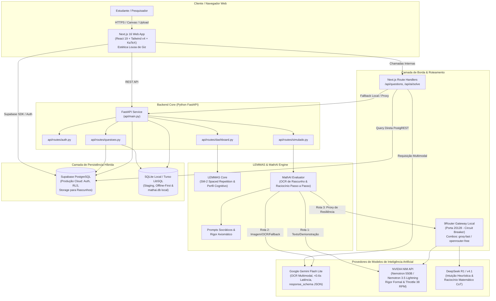

# Arquitetura do Sistema LEMMAS (Powered by MathAI Engine)

> **Documento:** Visão Geral de Arquitetura e Topologia do Monorepo  
> **Status:** Ativo / Produção  
> **Última Atualização:** 2026-10-08  
> **Plataforma:** LEMMAS Core  
> **Motor Cognitivo:** MathAI Engine  

---

## 1. Visão Geral Executiva

A plataforma **LEMMAS** é um ambiente educacional e cognitivo de alto desempenho desenvolvido para estudantes de ciências exatas (com foco inicial em Licenciatura e Bacharelado em Matemática, Engenharia e Concursos Militares de elite como ITA, IME, EFOMM, AFA, EsPCEx e ESA).

O produto é estruturado em torno da separação entre **experiência do usuário e gestão de memória** (Plataforma LEMMAS) e **inteligência matemática multimodal e verificação axiomática** (MathAI Engine):

1. **Plataforma LEMMAS & LEMMAS Core:**
   - Frontend moderno em [Next.js 16](file:///D:/dev/mathai-web/web/package.json) (React 19, Tailwind CSS v4).
   - Estética editorial de lousa de giz e quadro branco acadêmico (*chalkboard/whiteboard*).
   - Motor determinístico de repetição espaçada adaptativa baseado no algoritmo SuperMemo-2 ([`sm2.py`](file:///D:/dev/mathai-web/src/lemmas_core/sm2.py) e [`sm2.ts`](file:///D:/dev/mathai-web/web/lib/sm2.ts)).
   - Perfil cognitivo contínuo do estudante ([`cognitive_profile.py`](file:///D:/dev/mathai-web/src/lemmas_core/cognitive_profile.py)).

2. **MathAI Engine:**
   - Núcleo especialista de raciocínio matemático passo a passo.
   - OCR multimodal para digitalização e parsing de rascunhos em caderno físico e prints de tablets ([`evaluator.py`](file:///D:/dev/mathai-web/src/ai/evaluator.py)).
   - Roteamento multi-modelo entre modelos de fronteira com rigor formal (NVIDIA Nemotron 550B), intuição heurística (DeepSeek R1) e ultra-baixa latência com visão (Google Gemini Flash Lite).
   - Acervo curado de lemas, teoremas e gatilhos mentais para resolução de problemas.

---

## 2. Topologia do Monorepo

O repositório está organizado como um monorepo modular e coeso:

```
mathai-web/
├── api/                           # Backend REST FastAPI
│   ├── routes/
│   │   ├── auth.py                # Autenticação, 2FA, OTP e sessões
│   │   ├── questoes.py            # Consulta, paginação e filtragem do acervo
│   │   ├── dashboard.py           # Agregações cognitivas e perfil do aluno
│   │   └── simulado.py            # Sessões de treino e submissão
│   └── main.py                    # Ponto de entrada FastAPI e middlewares CORS
├── web/                           # Frontend Next.js 16 (App Router)
│   ├── app/
│   │   ├── (app)/                 # Rotas autenticadas (dashboard, resolver, perfil)
│   │   ├── (public)/              # Rotas públicas (landing page, login, sobre)
│   │   └── api/                   # Route Handlers Next.js (proxy para Supabase/IA)
│   ├── components/                # Componentes de UI (Lousa, KaTeX, Rascunho)
│   ├── lib/
│   │   ├── supabase.ts            # Cliente Supabase JS oficial
│   │   ├── sm2.ts                 # Algoritmo SM-2 client-side
│   │   └── math-parser.ts         # Parser e sanitizador de sintaxe LaTeX
│   └── packages/                  # Micro-pacotes Higgsfield / design system
├── src/                           # Núcleo Python da MathAI Engine e LEMMAS Core
│   ├── ai/
│   │   ├── client.py              # Clientes de API (Gemini, NVIDIA NIM, 9Router)
│   │   ├── evaluator.py           # Avaliador cognitivo multimodal e heurístico
│   │   ├── prompts.py             # Prompts de rigor matemático e pedagogia socrática
│   │   └── translator.py          # Tradutor e normalizador LaTeX
│   ├── database/
│   │   ├── db.py                  # Gerenciador de conexões SQLite / Turso LibSQL
│   │   ├── schema.sql             # Definição DDL relacional canônica
│   │   ├── attempts.py            # Operações de persistência de tentativas
│   │   └── users.py               # Gestão de identidades e perfis
│   ├── lemmas_core/
│   │   ├── models.py              # Dataclasses agnósticas de domínio
│   │   ├── sm2.py                 # Implementação de referência do SM-2
│   │   └── cognitive_profile.py   # Cálculo de taxas de domínio e taxonomia de erros
│   └── pipeline/                  # Ingestão e curadoria de dados (ENEM, MathNet, IME/ITA)
├── data/                          # Armazenamento de dados locais (mathai.db)
└── docs/                          # Documentação técnica e arquitetural de referência
```

---

## 3. Diagrama Geral do Sistema (C4 Container)



---

## 4. Componentes e Tecnologias Principais

### 4.1. Frontend: Next.js 16 + React 19 + Tailwind CSS v4
- **App Router e Renderização Híbrida:** Utiliza Server Components para renderização rápida do catálogo de questões e Client Components para o canvas interativo de desenho e resolução de exercícios.
- **Renderização Matemática:** Renderização de fórmulas LaTeX em tempo de execução via KaTeX, garantindo legibilidade perfeita de símbolos como integrais de contorno, somatórios duplos e tensores.
- **Design System Editorial:** Estética visual inspirada em lousas de universidades de excelência (tons verde-ardósia e azul-noturno profundo), contrastes calibrados com suporte a Light/Dark Mode (usando a diretiva `@custom-variant dark (&:where(.dark, .dark *));`).

### 4.2. Backend: FastAPI (Python 3.12+)
- **Desempenho Assíncrono:** Servidor ASGI com endpoints desacoplados em [`api/main.py`](file:///D:/dev/mathai-web/api/main.py) e documentação OpenAPI/Swagger automática em `/docs`.
- **CORS Calibrado:** Comunicação irrestrita e segura com o frontend Next.js (`http://localhost:3000` em desenvolvimento).
- **Validação com Pydantic:** Schemas tipados para requisições de submissão de respostas, notas metacognitivas e requisições de avaliação.

### 4.3. Persistência: Supabase (PostgreSQL 15+) & Turso / SQLite
- **Supabase Cloud:** Repositório oficial em nuvem gerenciado com suporte a Row Level Security (RLS), autenticação JWT e Buckets de Storage para armazenar os rascunhos manuscritos em alta resolução (`.png`, `.jpg`).
- **SQLite Local / Turso LibSQL:** Garante a filosofia *offline-first* para estudos em locais sem conexão estável, permitindo sincronização bidirecional do banco `mathai.db` via protocolo Hrana.

### 4.4. Orquestração de IA: 9Router + Direct Providers
- **9Router Local (Porta 20128):** Serviço executado localmente que padroniza requisições sob a especificação OpenAI `/v1/chat/completions`, integrando circuit breaker inteligente para isolar modelos indisponíveis e chavear automaticamente para modelos de reserva.
- **Direct Providers:** Conexões diretas de alta performance via SDK oficial `google-genai` (para Gemini Flash Lite) e endpoints OpenAI-compatíveis da NVIDIA NIM.

---

## 5. Práticas de Segurança e Isolamento

1. **Gestão de Segredos:** Nenhuma chave de API privada (`GEMINI_API_KEY`, `NVIDIA_API_KEY`, `SUPABASE_SERVICE_ROLE_KEY`) é exposta no bundle client-side do Next.js. O frontend comunica-se exclusivamente com suas rotas protegidas em `/api/` ou via chave pública segura (`NEXT_PUBLIC_SUPABASE_ANON_KEY`) com RLS estrito no banco.
2. **Prevenção de Injeção de Prompts:** Entradas fornecidas por alunos (textos de justificativa e imagens) são tratadas estritamente como *dados não confiáveis* e encapsuladas em blocos de delimitação rígida no prompt do sistema.
3. **Resiliência a Falhas:** Timeout agressivo (14 segundos para chamadas de IA) e circuit breakers evitam o travamento de requisições do estudante.
