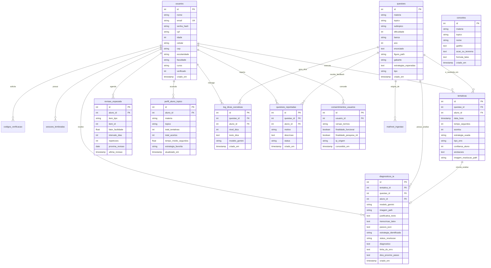

# Schema Relacional e Modelo de Dados (Database Schema)

> **Documento:** Especificação Técnica do Schema Relacional & Diagrama Entidade-Relacionamento  
> **Status:** Ativo / Produção  
> **Última Atualização:** 2026-10-08  
> **Bancos Homologados:** Supabase (PostgreSQL 15+) & SQLite 3 / Turso (LibSQL)  

---

## 1. Visão Geral da Modelagem

O schema do banco de dados da plataforma **LEMMAS (impulsionada pela MathAI Engine)** foi concebido para suportar:
1. **Multi-inquilino e Sessões Seguras:** Gestão granular de usuários, autenticação por código OTP e persistência de sessões de longa duração.
2. **Repetição Espaçada Adaptativa (SM-2):** Agendamento matemático determinístico de revisão por questão e conceito.
3. **Epistemologia de Dados de Aprendizagem:** Separação estrita entre tentativas factuais observadas (`tentativas`) e interpretações probabilísticas geradas por IA (`diagnosticos_ia`).
4. **Governança e Feedback:** Histórico de auditoria, consentimento LGPD e triagem de reportes de erros.

---

## 2. Diagrama Entidade-Relacionamento (ERD)



---

## 3. Especificação DDL das Tabelas (SQL Padrão / Supabase)

### 3.1. Núcleo de Identidade e Acesso

```sql
-- 1. Usuários e Perfil de Acesso
CREATE TABLE IF NOT EXISTS usuarios (
    id SERIAL PRIMARY KEY,
    nome VARCHAR(255) NOT NULL,
    email VARCHAR(255) NOT NULL UNIQUE,
    senha_hash VARCHAR(255) NOT NULL,
    cpf VARCHAR(14),
    idade INT CHECK (idade BETWEEN 5 AND 120),
    celular VARCHAR(25),
    cep VARCHAR(10),
    logradouro VARCHAR(255),
    numero VARCHAR(20),
    bairro VARCHAR(100),
    cidade VARCHAR(100),
    estado VARCHAR(2),
    motivos JSONB,
    escolaridade VARCHAR(50),
    faculdade VARCHAR(100),
    curso VARCHAR(100),
    concursos_foco JSONB,
    verificado INT NOT NULL DEFAULT 0,
    criado_em TIMESTAMP WITH TIME ZONE DEFAULT CURRENT_TIMESTAMP
);

-- 2. Códigos Temporários de Verificação (2FA / OTP)
CREATE TABLE IF NOT EXISTS codigos_verificacao (
    id SERIAL PRIMARY KEY,
    email VARCHAR(255) NOT NULL,
    codigo VARCHAR(10) NOT NULL,
    expira_em TIMESTAMP WITH TIME ZONE NOT NULL,
    usado INT NOT NULL DEFAULT 0,
    criado_em TIMESTAMP WITH TIME ZONE DEFAULT CURRENT_TIMESTAMP
);

-- 3. Sessões Lembradas (Persistent Tokens)
CREATE TABLE IF NOT EXISTS sessoes_lembradas (
    token VARCHAR(128) PRIMARY KEY,
    usuario_id INT NOT NULL REFERENCES usuarios(id) ON DELETE CASCADE,
    expira_em TIMESTAMP WITH TIME ZONE NOT NULL,
    criado_em TIMESTAMP WITH TIME ZONE DEFAULT CURRENT_TIMESTAMP
);
```

### 3.2. Banco de Conhecimento e Lemas Matemáticos

```sql
-- 4. Banco Canônico de Questões
CREATE TABLE IF NOT EXISTS questoes (
    id SERIAL PRIMARY KEY,
    materia VARCHAR(100) NOT NULL,
    topico VARCHAR(100) NOT NULL,
    subtopico VARCHAR(100),
    dificuldade INT CHECK (dificuldade BETWEEN 1 AND 5),
    banca VARCHAR(50),
    ano INT,
    enunciado TEXT NOT NULL,
    figura_path TEXT,
    gabarito VARCHAR(255),
    estrategias_esperadas JSONB,
    tipo VARCHAR(20) NOT NULL DEFAULT 'objetiva' CHECK (tipo IN ('objetiva', 'discursiva')),
    mathnet_id VARCHAR(100),
    criado_em TIMESTAMP WITH TIME ZONE DEFAULT CURRENT_TIMESTAMP
);

-- 5. Banco de Conceitos e Lemas (Gatilhos Mentais)
CREATE TABLE IF NOT EXISTS conceitos (
    id SERIAL PRIMARY KEY,
    materia VARCHAR(100) NOT NULL,
    topico VARCHAR(100) NOT NULL,
    nome VARCHAR(150) NOT NULL,
    gatilho TEXT NOT NULL,
    acao_ou_teorema TEXT NOT NULL,
    formula_latex TEXT,
    criado_em TIMESTAMP WITH TIME ZONE DEFAULT CURRENT_TIMESTAMP
);
```

### 3.3. Rastreamento Comportamental e Metacognição

```sql
-- 6. Histórico Factual de Tentativas (Evidência Imutável)
CREATE TABLE IF NOT EXISTS tentativas (
    id SERIAL PRIMARY KEY,
    questao_id INT NOT NULL REFERENCES questoes(id) ON DELETE CASCADE,
    aluno_id INT NOT NULL REFERENCES usuarios(id) ON DELETE CASCADE,
    data_hora TIMESTAMP WITH TIME ZONE DEFAULT CURRENT_TIMESTAMP,
    tempo_segundos INT NOT NULL CHECK (tempo_segundos >= 0),
    acertou INT NOT NULL CHECK (acertou IN (0, 1)),
    estrategia_usada TEXT,
    tipo_erro VARCHAR(50) DEFAULT 'nenhum' CHECK (
        tipo_erro IN ('nenhum', 'conta_sinal', 'manipulacao_algebrica', 'conceitual', 'interpretacao', 'outro', 'simulado_incorreto')
    ),
    confianca_aluno INT CHECK (confianca_aluno BETWEEN 1 AND 5),
    anotacoes TEXT,
    imagem_resolucao_path TEXT
);

-- 7. Motor de Repetição Espaçada (SM-2 Determinístico)
CREATE TABLE IF NOT EXISTS revisao_espacada (
    id SERIAL PRIMARY KEY,
    aluno_id INT NOT NULL REFERENCES usuarios(id) ON DELETE CASCADE,
    item_tipo VARCHAR(20) NOT NULL CHECK (item_tipo IN ('questao', 'conceito')),
    item_id INT NOT NULL,
    fator_facilidade NUMERIC(4, 2) DEFAULT 2.50 CHECK (fator_facilidade >= 1.30),
    intervalo_dias INT DEFAULT 1 CHECK (intervalo_dias >= 1),
    repeticoes INT DEFAULT 0 CHECK (repeticoes >= 0),
    proxima_revisao DATE NOT NULL,
    ultima_revisao TIMESTAMP WITH TIME ZONE DEFAULT CURRENT_TIMESTAMP,
    CONSTRAINT uq_revisao_aluno_item UNIQUE (aluno_id, item_tipo, item_id)
);

-- 8. Cache de Métricas por Tópico e Perfil Cognitivo
CREATE TABLE IF NOT EXISTS perfil_aluno_topico (
    id SERIAL PRIMARY KEY,
    aluno_id INT NOT NULL REFERENCES usuarios(id) ON DELETE CASCADE,
    materia VARCHAR(100) NOT NULL,
    topico VARCHAR(100) NOT NULL,
    total_tentativas INT DEFAULT 0 CHECK (total_tentativas >= 0),
    total_acertos INT DEFAULT 0 CHECK (total_acertos >= 0),
    tempo_medio_segundos NUMERIC(8, 2) DEFAULT 0.00 CHECK (tempo_medio_segundos >= 0.00),
    estrategia_favorita VARCHAR(100),
    atualizado_em TIMESTAMP WITH TIME ZONE DEFAULT CURRENT_TIMESTAMP,
    CONSTRAINT uq_perfil_aluno_topico UNIQUE (aluno_id, materia, topico)
);
```

### 3.4. Camada Derivada de Inteligência Artificial e Feedback

```sql
-- 9. Pareceres Pedagógicos e Transcrições Multimodais (Dados Derivados de IA)
CREATE TABLE IF NOT EXISTS diagnosticos_ia (
    id SERIAL PRIMARY KEY,
    tentativa_id INT REFERENCES tentativas(id) ON DELETE SET NULL,
    questao_id INT NOT NULL REFERENCES questoes(id) ON DELETE CASCADE,
    aluno_id INT NOT NULL REFERENCES usuarios(id) ON DELETE CASCADE,
    modelo_gemini VARCHAR(100),
    criado_em TIMESTAMP WITH TIME ZONE DEFAULT CURRENT_TIMESTAMP,
    imagem_path TEXT,
    justificativa_texto TEXT,
    transcricao_latex TEXT,
    passos_json JSONB,
    estrategia_identificada VARCHAR(100),
    status_resolucao VARCHAR(50),
    diagnostico TEXT,
    linha_do_erro TEXT,
    dica_proximo_passo TEXT
);

-- 10. Interações de Tutoria Socrática Passo a Passo
CREATE TABLE IF NOT EXISTS log_dicas_socraticas (
    id SERIAL PRIMARY KEY,
    questao_id INT NOT NULL REFERENCES questoes(id) ON DELETE CASCADE,
    aluno_id INT NOT NULL REFERENCES usuarios(id) ON DELETE CASCADE,
    nivel_dica INT NOT NULL CHECK (nivel_dica BETWEEN 1 AND 5),
    texto_dica TEXT,
    modelo_gemini VARCHAR(100),
    criado_em TIMESTAMP WITH TIME ZONE DEFAULT CURRENT_TIMESTAMP
);

-- 11. Curadoria Humana e Reportes de Inconsistência
CREATE TABLE IF NOT EXISTS questoes_reportadas (
    id SERIAL PRIMARY KEY,
    questao_id INT NOT NULL REFERENCES questoes(id) ON DELETE CASCADE,
    aluno_id INT REFERENCES usuarios(id) ON DELETE SET NULL,
    motivo VARCHAR(50) NOT NULL,
    descricao TEXT,
    status VARCHAR(30) DEFAULT 'pendente',
    criado_em TIMESTAMP WITH TIME ZONE DEFAULT CURRENT_TIMESTAMP
);
```

---

## 4. Índices para Otimização de Consultas em Alta Escala

Os seguintes índices cobrem 100% dos padrões de acesso frequentes da API e do frontend:

```sql
-- Busca rápida de contas e autenticação
CREATE INDEX IF NOT EXISTS idx_usuarios_email ON usuarios(email);
CREATE INDEX IF NOT EXISTS idx_sessoes_token ON sessoes_lembradas(token);
CREATE INDEX IF NOT EXISTS idx_codigos_email_codigo ON codigos_verificacao(email, codigo);

-- Filtragem do acervo de questões
CREATE INDEX IF NOT EXISTS idx_questoes_materia_topico ON questoes(materia, topico);
CREATE INDEX IF NOT EXISTS idx_questoes_banca_ano ON questoes(banca, ano);

-- Histórico do estudante e performance
CREATE INDEX IF NOT EXISTS idx_tentativas_aluno_data ON tentativas(aluno_id, data_hora DESC);
CREATE INDEX IF NOT EXISTS idx_tentativas_questao ON tentativas(questao_id);

-- Execução do motor de repetição espaçada
CREATE INDEX IF NOT EXISTS idx_revisao_agenda ON revisao_espacada(aluno_id, proxima_revisao);

-- Consultas analíticas de IA
CREATE INDEX IF NOT EXISTS idx_diagnosticos_tentativa ON diagnosticos_ia(tentativa_id);
CREATE INDEX IF NOT EXISTS idx_diagnosticos_aluno ON diagnosticos_ia(aluno_id);
CREATE INDEX IF NOT EXISTS idx_log_dicas_aluno_questao ON log_dicas_socraticas(aluno_id, questao_id);
```
